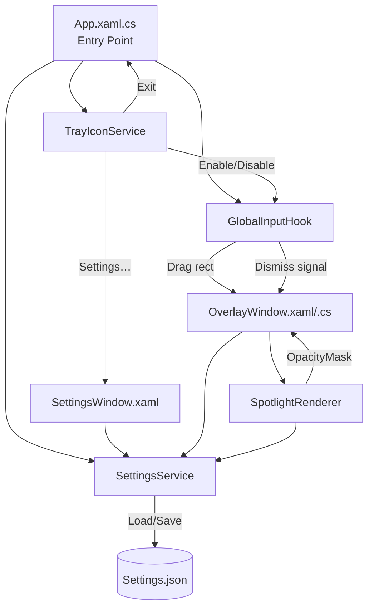
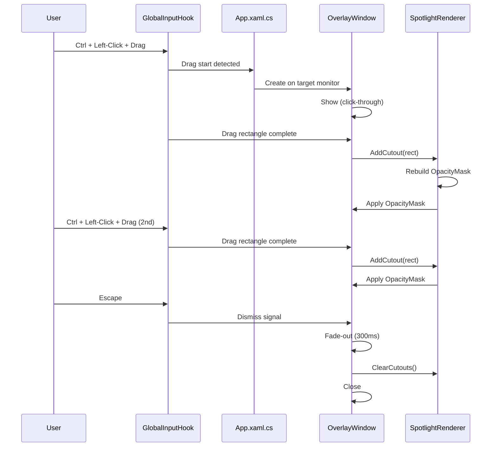

# Design Document: Spotlight Overlay

## Overview

The Spotlight Overlay is a Windows desktop application built with C# and WPF targeting .NET 8. It runs as a system tray application and provides a live, darkened overlay with feathered rectangular spotlight cutouts during presentations. Users activate spotlights via a global Ctrl+Left-Click+Drag gesture, can create multiple cutouts, and dismiss the overlay with Escape (including a 300ms fade-out animation). The application supports multi-monitor setups, persists user settings to JSON, and ships as a single self-contained executable.

The core rendering approach uses a combined `DrawingGroup`-based `OpacityMask` on a full-screen transparent overlay window. Each spotlight cutout is represented as a gradient brush region within the mask, allowing multiple cutouts to coexist. Global input is captured via `SetWindowsHookEx` low-level hooks, and the overlay window toggles between click-through and input-capturing modes depending on whether a drag gesture is in progress.

## Architecture

The application follows a service-oriented architecture with clear separation between input handling, rendering, settings management, and UI.



### Component Interaction Flow



## Components and Interfaces

### 1. App.xaml.cs — Application Entry Point

Responsibilities:
- Initialize the WPF application without a main window (`ShutdownMode = OnExplicitShutdown`)
- Instantiate and wire up `TrayIconService`, `SettingsService`, `GlobalInputHook`, and `SpotlightRenderer`
- Handle application lifecycle (startup, shutdown, cleanup of hooks and tray icon)

### 2. TrayIconService

Responsibilities:
- Create and manage a `System.Windows.Forms.NotifyIcon` in the system tray
- Provide a context menu with "Enable/Disable Spotlight", "Settings…", and "Exit"
- Raise events for menu selections

```csharp
public class TrayIconService : IDisposable
{
    public event EventHandler? ToggleSpotlightRequested;
    public event EventHandler? SettingsRequested;
    public event EventHandler? ExitRequested;

    public TrayIconService(System.Drawing.Icon icon);
    public void SetEnabled(bool isEnabled); // Updates menu text
    public void ShowBalloon(string title, string message);
    public void Dispose();
}
```

### 3. GlobalInputHook

Responsibilities:
- Register low-level mouse (`WH_MOUSE_LL`) and keyboard (`WH_KEYBOARD_LL`) hooks via `SetWindowsHookEx`
- Detect Ctrl+Left-Click+Drag gesture and emit drag rectangles
- Detect Escape key press and emit dismiss signal
- Support enable/disable toggling

```csharp
public class GlobalInputHook : IDisposable
{
    public event EventHandler<DragRectEventArgs>? DragCompleted;
    public event EventHandler? DismissRequested;

    public bool IsEnabled { get; set; }

    public void Install();   // Calls SetWindowsHookEx
    public void Uninstall(); // Calls UnhookWindowsHookEx
    public void Dispose();
}

public class DragRectEventArgs : EventArgs
{
    public Rect ScreenRect { get; }      // Drag rectangle in screen coordinates
    public Point DragStartPoint { get; } // Used for monitor identification
}
```

P/Invoke signatures required:
- `SetWindowsHookEx(int idHook, LowLevelProc lpfn, IntPtr hMod, uint dwThreadId)`
- `UnhookWindowsHookEx(IntPtr hhk)`
- `CallNextHookEx(IntPtr hhk, int nCode, IntPtr wParam, IntPtr lParam)`
- `GetModuleHandle(string lpModuleName)`
- `GetKeyState(int nVirtKey)` — to check Ctrl state during mouse events

### 4. OverlayWindow (OverlayWindow.xaml / OverlayWindow.xaml.cs)

Responsibilities:
- Full-screen, borderless, transparent, topmost WPF window
- Apply `OpacityMask` from `SpotlightRenderer` to reveal cutout regions
- Toggle between click-through (WS_EX_TRANSPARENT) and input-capturing modes
- Execute 300ms Storyboard fade-out animation on dismiss

XAML properties:
- `AllowsTransparency="True"`
- `WindowStyle="None"`
- `Topmost="True"`
- `Background` = semi-transparent black brush (opacity from settings)

```csharp
public partial class OverlayWindow : Window
{
    public OverlayWindow(Rect monitorBounds, double overlayOpacity);

    public void ApplyOpacityMask(DrawingGroup mask);
    public void BeginFadeOut(Action onComplete); // 300ms Storyboard animation
    
    // Click-through toggle via SetWindowLong/WS_EX_TRANSPARENT
    public void SetClickThrough(bool enabled);
}
```

P/Invoke for click-through:
- `GetWindowLong(IntPtr hWnd, int nIndex)`
- `SetWindowLong(IntPtr hWnd, int nIndex, int dwNewLong)`
- Constants: `GWL_EXSTYLE`, `WS_EX_TRANSPARENT`, `WS_EX_LAYERED`

### 5. SpotlightRenderer

Responsibilities:
- Maintain a list of active `Rect` cutout regions
- Generate a combined `DrawingGroup` opacity mask with feathered gradient edges for each cutout
- Rebuild the mask when cutouts are added or cleared

```csharp
public class SpotlightRenderer
{
    private readonly List<Rect> _cutouts = new();

    public SpotlightRenderer(SettingsService settings);

    public void AddCutout(Rect rect);
    public void ClearCutouts();
    public int CutoutCount { get; }
    public IReadOnlyList<Rect> Cutouts { get; }
    public DrawingGroup BuildOpacityMask(Size overlaySize);
}
```

Rendering approach:
- The `DrawingGroup` contains a full-size black `GeometryDrawing` (fully opaque = fully dark)
- Each cutout is rendered as a white `RadialGradientBrush` or `LinearGradientBrush` rectangle within the mask
- White regions in the mask become transparent in the overlay, revealing content underneath
- The `Feather_Radius` controls the gradient stop positions to create soft edges

### 6. SettingsService

Responsibilities:
- Load/save settings from `Settings.json` in the application directory
- Provide default values when file is missing or invalid
- Validate and clamp values to valid ranges
- Expose settings as observable properties

```csharp
public class SettingsService
{
    public double OverlayOpacity { get; set; }  // [0.0, 1.0], default 0.5
    public int FeatherRadius { get; set; }       // >= 0, default 30

    public void Load();  // From Settings.json
    public void Save();  // To Settings.json

    public static AppSettings Deserialize(string json);
    public static string Serialize(AppSettings settings);
    public static AppSettings Validate(AppSettings settings); // Clamp to valid ranges
}

public record AppSettings(double OverlayOpacity, int FeatherRadius);
```

Serialization: `System.Text.Json.JsonSerializer` with default options.

### 7. SettingsWindow (SettingsWindow.xaml)

Responsibilities:
- WPF dialog with Slider for `OverlayOpacity` and NumericUpDown/Slider for `FeatherRadius`
- Bind to `SettingsService` and trigger save on change
- Singleton pattern — bring to foreground if already open

```csharp
public partial class SettingsWindow : Window
{
    public SettingsWindow(SettingsService settings);
}
```

## Data Models

### AppSettings

```csharp
public record AppSettings(
    double OverlayOpacity,  // Range: [0.0, 1.0], Default: 0.5
    int FeatherRadius       // Range: [0, ∞), Default: 30
);
```

### Settings.json Schema

```json
{
  "OverlayOpacity": 0.5,
  "FeatherRadius": 30
}
```

### DragRectEventArgs

```csharp
public class DragRectEventArgs : EventArgs
{
    public Rect ScreenRect { get; }      // Absolute screen coordinates
    public Point DragStartPoint { get; } // For monitor identification
}
```

### Internal State

| Component | State | Type |
|-----------|-------|------|
| GlobalInputHook | Hook enabled flag | `bool` |
| GlobalInputHook | Drag in progress | `bool` |
| GlobalInputHook | Drag start point | `Point?` |
| SpotlightRenderer | Active cutouts | `List<Rect>` |
| OverlayWindow | Current monitor bounds | `Rect` |
| OverlayWindow | Click-through state | `bool` |
| SettingsService | Current settings | `AppSettings` |

### Monitor Identification

Multi-monitor support uses `System.Windows.Forms.Screen.AllScreens` to determine which monitor contains the drag start point:

```csharp
Screen targetScreen = Screen.AllScreens
    .FirstOrDefault(s => s.Bounds.Contains((int)point.X, (int)point.Y))
    ?? Screen.PrimaryScreen;
```

## Correctness Properties

*A property is a characteristic or behavior that should hold true across all valid executions of a system — essentially, a formal statement about what the system should do. Properties serve as the bridge between human-readable specifications and machine-verifiable correctness guarantees.*

### Property 1: Toggle hook state is consistent

*For any* number of toggles N applied to the GlobalInputHook starting from an initial enabled/disabled state, the resulting `IsEnabled` state should equal the initial state XOR (N is odd).

**Validates: Requirements 1.4**

### Property 2: Disabled hook ignores all inputs

*For any* input event (drag gesture or Escape key press), if the GlobalInputHook `IsEnabled` is false, then no `DragCompleted` or `DismissRequested` event shall be emitted.

**Validates: Requirements 1.5**

### Property 3: Drag points produce correct rectangle

*For any* two screen-coordinate points (start, end), the emitted `ScreenRect` should have `X = min(start.X, end.X)`, `Y = min(start.Y, end.Y)`, `Width = |end.X - start.X|`, and `Height = |end.Y - start.Y|`.

**Validates: Requirements 2.3**

### Property 4: Overlay matches monitor bounds and opacity

*For any* monitor bounds rectangle and any valid Overlay_Opacity value, the created OverlayWindow should have position and size equal to the monitor bounds, and its background opacity should equal the configured Overlay_Opacity.

**Validates: Requirements 3.3, 3.4, 7.2**

### Property 5: Cutout accumulation preserves all entries

*For any* sequence of N distinct rectangles added to the SpotlightRenderer, the `Cutouts` list should contain exactly those N rectangles in insertion order, and `CutoutCount` should equal N.

**Validates: Requirements 4.1**

### Property 6: Opacity mask reflects all active cutouts

*For any* set of cutout rectangles added to the SpotlightRenderer, the `DrawingGroup` returned by `BuildOpacityMask` should contain exactly one drawing element per cutout plus one background element, all combined in a single `DrawingGroup`.

**Validates: Requirements 4.3, 5.3**

### Property 7: Feather radius controls gradient extent

*For any* cutout rectangle and any non-negative feather radius, the gradient brush generated for that cutout should have its transition region width equal to the configured feather radius value.

**Validates: Requirements 5.2**

### Property 8: Monitor identification from point

*For any* set of non-overlapping monitor bounds and any point that lies within one of those bounds, the monitor identification function should return the monitor whose bounds contain that point.

**Validates: Requirements 7.1**

### Property 9: Screen-to-window coordinate translation

*For any* screen-space rectangle and any monitor offset (top-left corner of the target monitor), subtracting the monitor offset from the rectangle coordinates should produce window-relative coordinates, and adding the offset back should recover the original screen coordinates (round-trip).

**Validates: Requirements 7.3**

### Property 10: Settings validation and clamping

*For any* numeric values for OverlayOpacity and FeatherRadius (including out-of-range values), the `Validate` function should return an `AppSettings` where OverlayOpacity is in [0.0, 1.0] and FeatherRadius is >= 0. Furthermore, if the input values are already in range, the output should equal the input.

**Validates: Requirements 8.5, 8.6**

### Property 11: Settings serialization round-trip

*For any* valid `AppSettings` object (with OverlayOpacity in [0.0, 1.0] and FeatherRadius >= 0), serializing to JSON and then deserializing should produce an `AppSettings` object equal to the original, preserving exact numeric precision.

**Validates: Requirements 11.1, 11.2, 8.4**

## Error Handling

| Scenario | Component | Behavior |
|----------|-----------|----------|
| `SetWindowsHookEx` fails | GlobalInputHook | Log error, show balloon notification via TrayIconService, hook remains uninstalled |
| Settings.json missing | SettingsService | Create default file (opacity=0.5, radius=30), log info |
| Settings.json invalid JSON | SettingsService | Log warning, use defaults, do not overwrite the corrupt file |
| Settings values out of range | SettingsService | Clamp to valid boundaries silently |
| Overlay creation fails | OverlayWindow | Log error, return to idle state, do not crash |
| Monitor not found for point | App.xaml.cs | Fall back to primary monitor |
| Settings_Window already open | App.xaml.cs | Bring existing window to foreground |
| Fade-out animation interrupted | OverlayWindow | Complete cleanup (close window, clear cutouts) regardless |

## Testing Strategy

### Unit Tests

Unit tests cover specific examples, edge cases, and integration points:

- **TrayIconService**: Context menu contains exactly 3 items with correct labels (Req 1.2). Exit removes icon (Req 1.3).
- **GlobalInputHook**: Ctrl+Click starts drag tracking (Req 2.2). Escape emits dismiss when overlay visible (Req 2.4). Hook failure shows balloon (Req 2.5).
- **OverlayWindow**: Window properties are AllowsTransparency=True, WindowStyle=None, Topmost=True (Req 3.2). Click-through enabled when no drag (Req 3.5). Click-through disabled during drag (Req 3.6).
- **SpotlightRenderer**: Supports 10 simultaneous cutouts (Req 4.2). Gradient uses DrawingBrush/GradientBrush (Req 5.1). Updated radius applies to new cutouts (Req 5.4).
- **OverlayWindow animation**: Fade-out duration is 300ms (Req 6.2). Window closes after fade (Req 6.3). Cutouts cleared after fade (Req 6.4). App returns to idle (Req 6.5).
- **SettingsService**: Loads from file on startup (Req 8.1). Creates defaults when file missing (Req 8.2). Uses defaults on invalid JSON (Req 8.3).
- **SettingsWindow**: Opens from tray menu (Req 9.1). Shows opacity and radius controls (Req 9.2). Singleton behavior (Req 9.4).

### Property-Based Tests

Property-based tests use a PBT library to verify universal properties across generated inputs. Each test runs a minimum of 100 iterations.

**Library**: [FsCheck](https://fscheck.github.io/FsCheck/) with xUnit integration (`FsCheck.Xunit`)

| Test | Property | Tag |
|------|----------|-----|
| ToggleHookState | Property 1 | Feature: spotlight-overlay, Property 1: Toggle hook state is consistent |
| DisabledHookIgnoresInput | Property 2 | Feature: spotlight-overlay, Property 2: Disabled hook ignores all inputs |
| DragPointsToRect | Property 3 | Feature: spotlight-overlay, Property 3: Drag points produce correct rectangle |
| OverlayMatchesMonitor | Property 4 | Feature: spotlight-overlay, Property 4: Overlay matches monitor bounds and opacity |
| CutoutAccumulation | Property 5 | Feature: spotlight-overlay, Property 5: Cutout accumulation preserves all entries |
| MaskReflectsCutouts | Property 6 | Feature: spotlight-overlay, Property 6: Opacity mask reflects all active cutouts |
| FeatherRadiusGradient | Property 7 | Feature: spotlight-overlay, Property 7: Feather radius controls gradient extent |
| MonitorIdentification | Property 8 | Feature: spotlight-overlay, Property 8: Monitor identification from point |
| CoordinateTranslation | Property 9 | Feature: spotlight-overlay, Property 9: Screen-to-window coordinate translation |
| SettingsValidation | Property 10 | Feature: spotlight-overlay, Property 10: Settings validation and clamping |
| SettingsRoundTrip | Property 11 | Feature: spotlight-overlay, Property 11: Settings serialization round-trip |

Each property-based test MUST be implemented as a single test method with the `[Property(MaxTest = 100)]` attribute and a comment referencing the design property tag.
